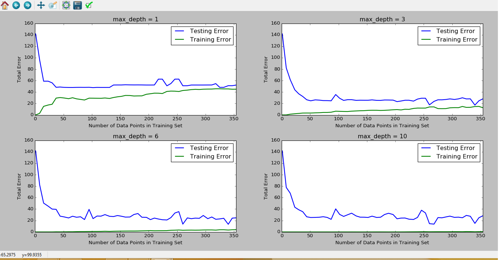

# boston_house_price_prediction

##My Work in project

In this project, I evaluate the performance and predictive power of a model that has been trained and tested on data collected from homes in suburbs of Boston, Massachusetts. A model trained on this data that is seen as a good fit could then be used to make certain predictions about a home. I applied basic machine learning concepts on data collected for housing prices of area to predict the selling price of a new home. I used NumPy library to analyze data to obtain important features decsriptive imformation about the dataset. I split the data into training and testing subsets and determine a suitable performance metrics.  I analyzed performance graphs for a learning algorithm with varying parameters and training set sizes. Finally, I tested this model on a new sample and compare the predicted selling price to my statistics. The result was less than one standard deviation away from the mean.

##What I learnt

### I leaned to working with datasets and applying machine learning techniques using NumPy and Scikit-Learn
things i learned:
   ->using NumPy to analyze the dataset
   ->analyzing various learning performance plots
   ->determine the best model by guessing for any data
   ->Model fitting, data train & test split, cross-validation, & parameter optimization with grid search.
   
   
   
   

